# Main Function
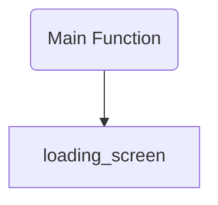
# Loading Screen Function
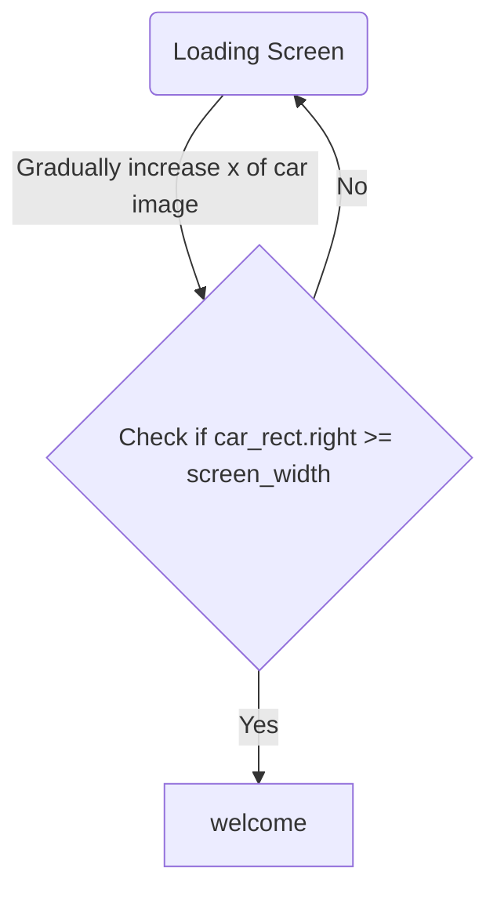
# Welcome Screen Function
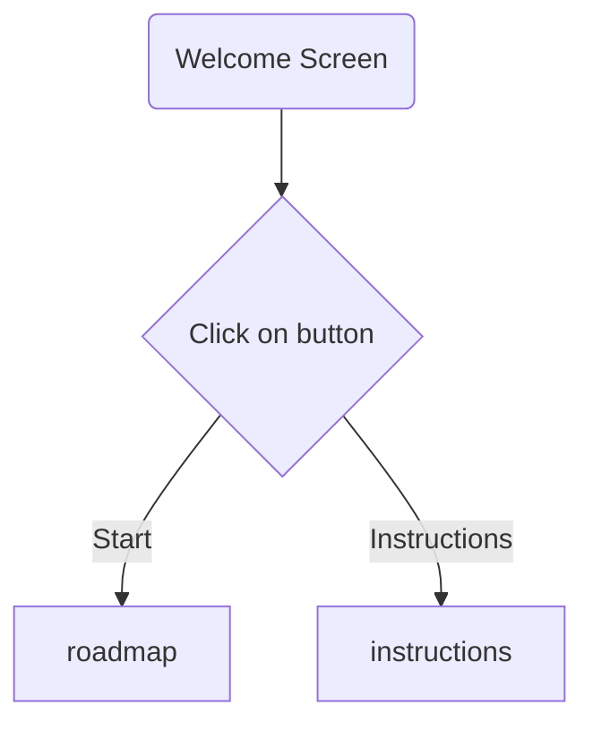
# Instructions Function
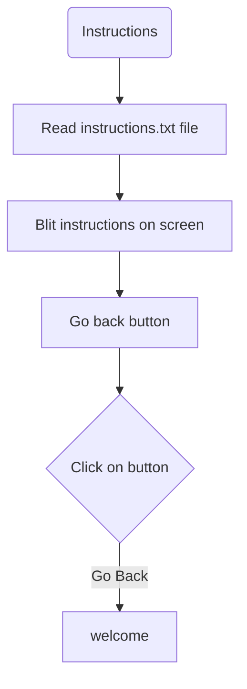
# Roadmap Screen Function
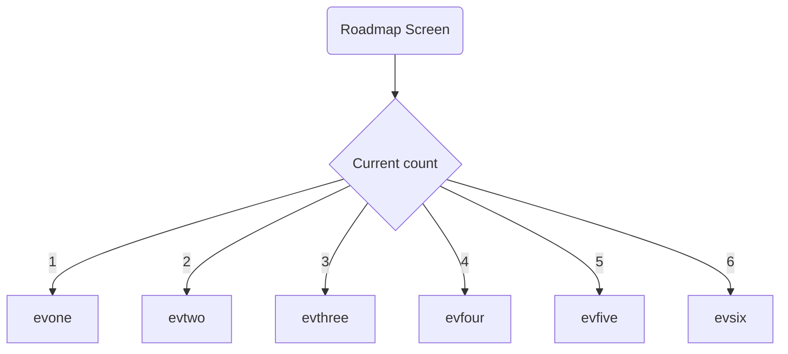
# evone Function
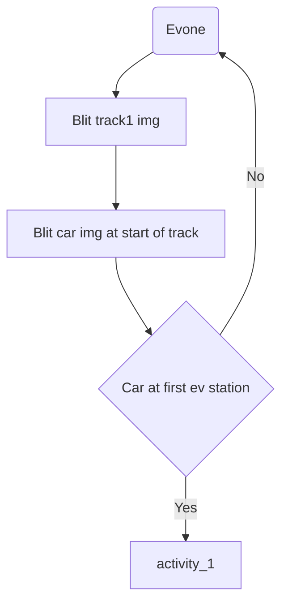
# evtwo Function
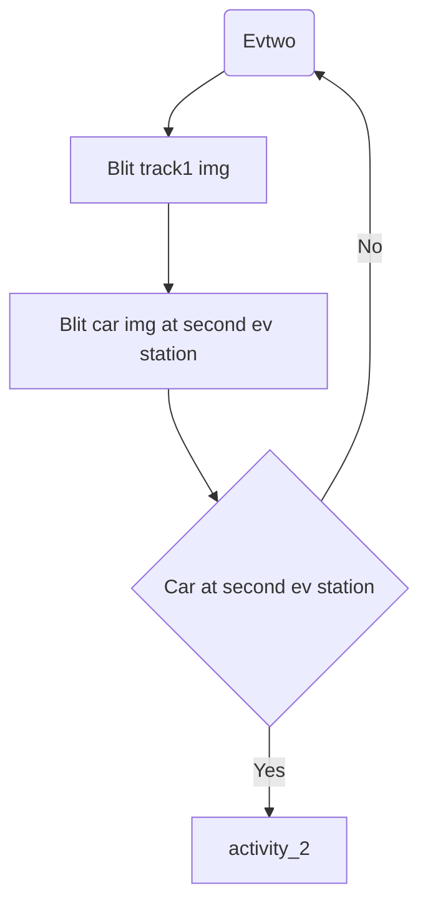
# evthree Function
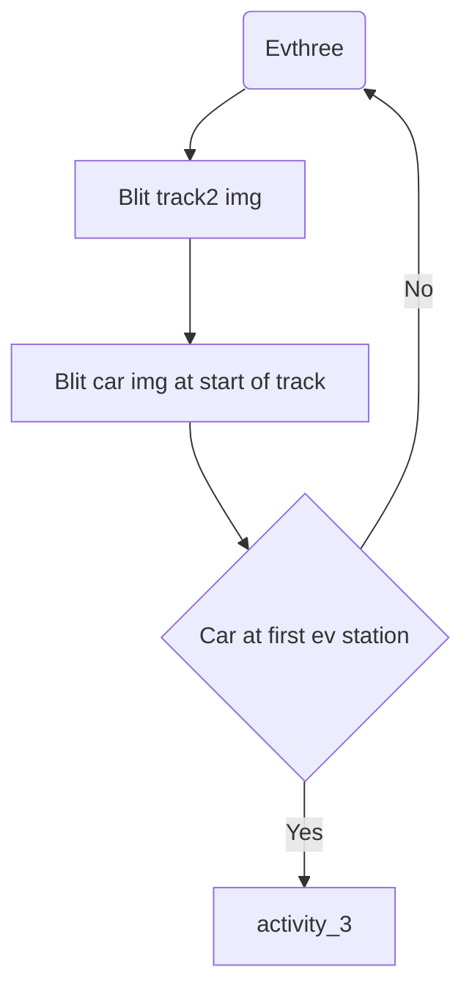
# evfour Function

# evfive Function
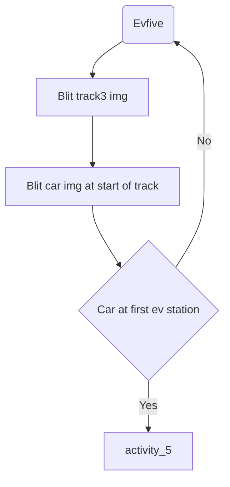
# evsix Function

# activity_1 Function


# activity_2 Function


# activity_3 Function


# activity_4 Function

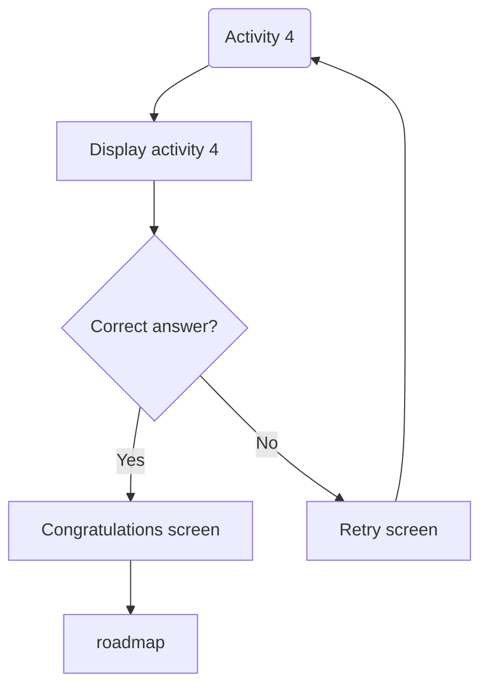
# activity_5 Function


# activity_6 Function

```mermaid
flowchart TD
    activity_6(Activity 6) --> display_activity6[Display activity 6]
    display_activity6 --> check_answer{Correct answer?}
    check_answer -->|Yes| finish_screen
    check_answer -->|No| retry_6[Retry screen]
    finish_screen --> congratulations[Congratulations screen]
    retry_6 --> activity_6
  ```  
# Finish Screen Function

```mermaid
flowchart TD
    finish_screen(Finish Screen) --> display_finish[Display final screen]
    display_finish --> play_again_button[Play again button]
    play_again_button --> decision{Click on button}
    decision -->|Yes| reset_game
```
# Reset Game Function
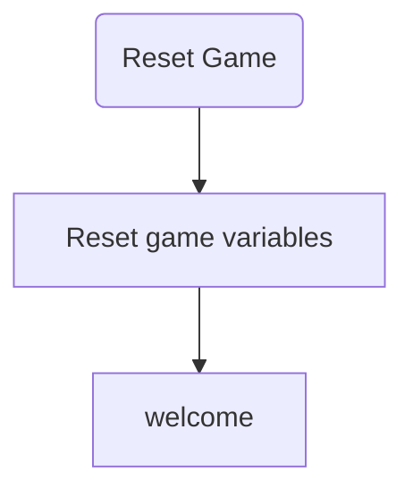
